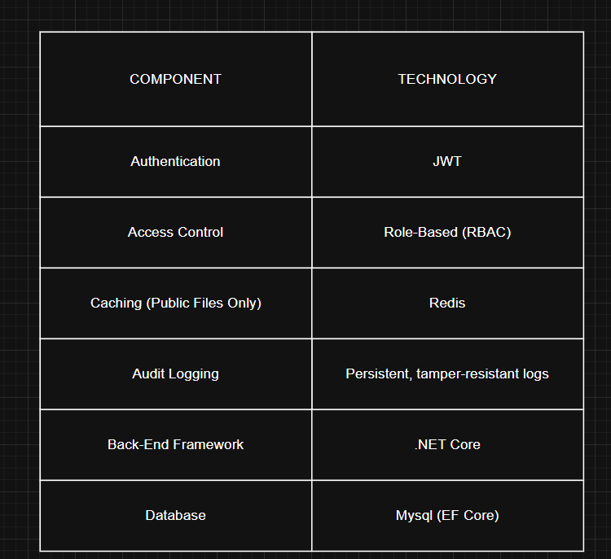

# PandoraLock

**A secure and scalable backend for encrypted file management and sharing**

*Designed to protect what should never be exposed*

---

## Overview

PandoraLock provides enterprise-grade security for file management through AES-256-GCM encryption, RSA/ECC key management, and role-based access control. Users can share files privately with fine-grained permissions or make them publicly available via a Redis-powered caching layer, while maintaining complete visibility through tamper-resistant audit logs.

> **Note:** This project is currently under active development and is not yet production-ready. Contributions, design discussions, and feedback are welcome.

---

## Features

### Security & Encryption
- **AES-256-GCM** file encryption for maximum security
- **RSA/ECC** secure key management and exchange
- **Zero-trust architecture** with end-to-end protection

### Authentication & Authorization
- **JWT-based authentication** for secure session management
- **Role-based access control (RBAC)** for granular permissions
- **Multi-layered security** validation

### File Management & Sharing
- **Secure file sharing** with customizable permissions
- **Public dashboard access** with Redis-backed caching
- **Fine-grained control** over file visibility and access

### Monitoring & Compliance
- **Comprehensive audit logging** for all file operations
- **Tamper-resistant storage** for security events
- **Real-time monitoring** of system activities

### Performance & Scalability
- **Redis caching** for optimized performance
- **Scalable architecture** for growing user bases
- **Containerized deployment** with Docker 

---

## Technology Stack

---

## Development Roadmap

- [x] **Core Infrastructure**
  - [x] File upload, encryption, and retrieval
  - [x] Database schema and migrations
  - [x] Error handling and validation

- [x] **Authentication System**
  - [x] JWT implementation
  - [x] User registration and login
  - [x] Password security and recovery

- [ ] **Authorization & Permissions**
  - [ ] Role-based permission layers
  - [ ] Fine-grained access controls
  - [ ] Permission inheritance

- [x] **File Sharing & Caching**
  - [x] Public file caching with Redis
  - [x] Private sharing mechanisms
  - [x] Link expiration and access limits

- [ ] **Monitoring & Audit**
  - [x] Comprehensive audit logging system
  - [x] Security event tracking
  - [ ] Performance monitoring

- [x] **Deployment & DevOps**
  - [x] Docker containerization
  - [x] CI/CD pipeline setup

---

## Security Philosophy

**Zero Trust by Design**

PandoraLock operates on the principle that security cannot be an afterthought. Every component is designed with security-first principles:

- **Files are encrypted** before they ever touch storage
- **Cryptographic keys** are managed through secure, industry-standard protocols
- **All actions are logged** in tamper-resistant audit trails
- **Access is verified** at every layer of the system

This approach ensures transparency, accountability, and protection against both external threats and internal vulnerabilities.

---

**Built with security, designed for scale - Developer Jordan Isaac**

